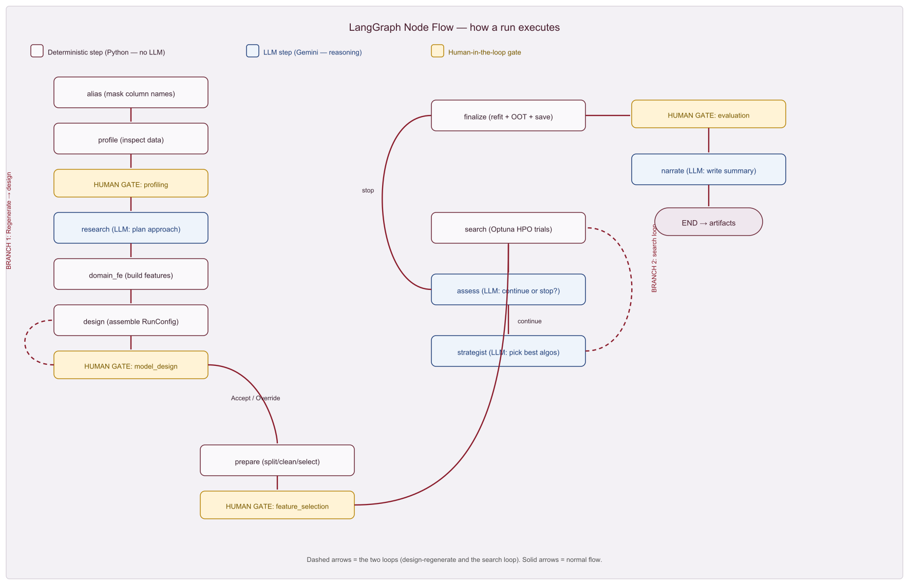

# 🤖 AutoML-Agent: GenAI-Based Agentic AI System for Automated Model Development

## 📌 Overview
**AutoML-Agent** is an agentic AI system that automates the end-to-end machine learning model development lifecycle — from data profiling to training and evaluation — using only a natural-language prompt. Instead of manually writing code for each stage of the ML pipeline, a user simply describes the objective (e.g., *"build a propensity model for credit card upsell"*) and provides a dataset, and the system autonomously handles the rest.

This project was built during my Data Science internship at **Axis Bank**, where it was applied to build a **propensity model for credit card upsell**.

---

## ✨ Key Features
- 🗣️ **Prompt-driven pipeline** — Users provide only an objective and a dataset (CSV or other formats); the system handles profiling, cleaning, feature engineering, training, and evaluation automatically.
- 🧠 **LLM-driven decision-making** — An LLM "researcher" node determines the best algorithm, out-of-time (OOT) validation window, and training period based on the use case.
- 🌳 **Algorithm-specific training paths** — Separate training pipelines for logistic regression and tree-based algorithms, each driven by distinct prompts tailored to that model family.
- 🧑‍💻 **Human-in-the-loop checkpoints** — Users can review and override LLM-driven decisions at key stages instead of relying on full automation.
- ⚡ **Scalable data processing** — Built on PySpark to handle large-scale datasets (20M+ rows, ~1,000 features).
- 📊 **Experiment tracking** — Integrated with MLflow for tracking training runs and evaluation metrics.
- 💰 **Cost monitoring** — Token usage tracked via Gemini Pro API response metadata to monitor LLM costs.

---

## 🛠️ Tech Stack
| Category | Tools |
|---|---|
| Orchestration | LangGraph |
| LLM | Gemini Pro API |
| Data Processing | PySpark |
| Experiment Tracking | MLflow |
| Language | Python |

---

## 🏗️ Architecture
The system is built as a multi-agent graph using **LangGraph**, where each node handles a specific stage of the ML pipeline (profiling, cleaning, feature engineering, algorithm selection, training, evaluation). Conditional routing directs the flow based on LLM decisions, with human-in-the-loop checkpoints inserted after key decision points to allow user review and override.

### 🔄 Project Flow

---

## ⚙️ How It Works
1. 🎯 User provides a modeling objective (e.g., *"build a propensity model"*) and a dataset.
2. 🧠 The LLM researcher node analyzes the objective and data to decide the algorithm family, OOT window, and training period.
3. 🔀 Based on the algorithm selected, the pipeline routes to the appropriate training path (logistic regression or tree-based), each using a tailored prompt.
4. ✅ Human-in-the-loop checkpoints allow the user to accept or override key decisions.
5. 📈 The model is trained, evaluated, and results/metrics are logged via MLflow.

---

---

## 🚀 Future Improvements
- ➕ Support for additional algorithm families
- 🔧 Automated hyperparameter tuning integration
- 📊 Expanded evaluation metric dashboard

---

## 👤 Author
**Atharaw Patle**
[🔗 LinkedIn](https://linkedin.com/in/atharw-patle) &nbsp;|&nbsp; [💻 GitHub](https://github.com/Atharw10)
